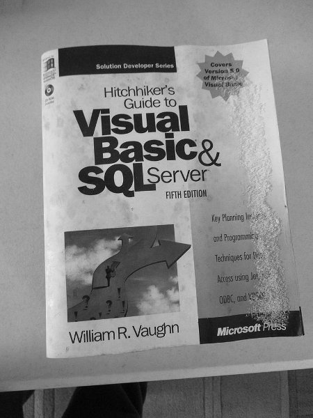
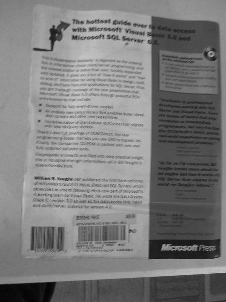

# try-azure-ocr

Try using the [Azure Form Recognizer](https://learn.microsoft.com/en-us/azure/applied-ai-services/form-recognizer/overview?tabs=v3-0&view=form-recog-3.0.0) to do [Optical Character Recognition](https://learn.microsoft.com/en-us/azure/applied-ai-services/form-recognizer/concept-read?view=form-recog-3.0.0) (OCR) on images of book covers. 

## Background

The images used for this OCR experiment are pictures of the front and back covers of books. The pictures were taken before the books were discarded after being damaged by water. Many of the book covers were crinkled and moldy, and some images were out of focus.

*Sad story:* I lost a big part of my collection of (mostly) computer books when the main water line to the house broke in the middle of the night and the cellar, where the books were stored, turned into a wading pool with about three feet of water.

I tried doing OCR on this set of images a while back using [Tesseract OCR](https://github.com/tesseract-ocr/tesseract) automated with a Python script. The images were also processed to sharpen, and create grayscale versions, before running Tesseract, to see if that improved the results. It did not help much. The results were not good, but given the content and quality of the images that was not unexpected. This was an experiment (and not an important one), so I dropped it, but kept the set of images. Seeing there is an OCR offering from Azure, I decided to give it a try using the same set of images.

## The Azure Service

The **Form Recognizer** is part of [Azure Applied AI Services](https://learn.microsoft.com/en-us/azure/applied-ai-services/?view=form-recog-3.0.0).

Initially using the [free tier](https://learn.microsoft.com/en-us/azure/applied-ai-services/form-recognizer/service-limits?view=form-recog-3.0.0) (F0).

- More [pricing details](https://azure.microsoft.com/en-us/pricing/details/form-recognizer/#pricing).

## The Console Application

Used **Visual Studio 2022** to create a *.NET 6.0 (LTS)* **Console App** named **AzureOCRConsoleApp** (creative, I know).

Added [Configuration Extensions](https://learn.microsoft.com/en-us/dotnet/core/extensions/configuration#basic-example) and code to read settings from a local JSON file outside of the project directory.

Followed the example of using the [Read Model](https://learn.microsoft.com/en-us/azure/applied-ai-services/form-recognizer/how-to-guides/use-sdk-rest-api#read-model) to get started.

The path to a single image file to be processed is hard-coded at this point. That can easily be changed to a different method:
- Use a hard-coded list of multiple images (throttle to *service limits*).
- Take a file name as a command-line argument and run the app from a script.
- Pass (or hard-code) the name of a text file containing a list of images to process.
- Adapt the code to use in an Azure Function, blob-trigger maybe.

## Examples

The initial runs, doing a few individual images, one at a time, have produced surprisingly good results given the quality of the input.

This front-cover image:

Produced this result:

>   Solution Developer Series
    Covers
    Version 5.0
    of Microsi.
    Visual Basic
    Hitchhiker's
    Guide to
    Visual
    Basic&
    SQLServer
    FIFTH EDITION
    William R. Vaughn
    Key Planning Insåg0ks
    and Programming
    Techniques for Less
    Access using Jet,
    ODBC, and VESOY
    Microsoft Press

This back-cover image:

Produced this result:

>   The hottest guide over to data 866664
    with Microsoft Visual Basic 5.0 and
    Microsoft SQL Server 05.
    Miomsoft Houal Basic
    enhancementis that inclule:
    An entirely new cansu
    Side danors and differ new canat
    Implementation of sanit alone (dodonnesion muses
    Fintallis the companion C
    fully updated software to
    William R. Vaughn self- published the Int three eltions
    enBodied an antent flowing, Hit snow part of Meussoll's
    marteling team for Visual Basic. Re wrote the Data Access
    Guide for version 30 as well as the dall ases Rep fonics
    and client/server material for version 40.
    S. Server than anyone in die
    motif ar Douglas Adams
    Microsoft Press

---

## Other Links

- [Computer Vision documentation](https://learn.microsoft.com/en-us/azure/cognitive-services/computer-vision/) - Quickstarts, Tutorials, API Reference - Azure Cognitive Services - Microsoft Learn

- [OCR - Optical Character Recognition](https://learn.microsoft.com/en-us/azure/cognitive-services/computer-vision/overview-ocr) - Azure Cognitive Services - Microsoft Learn

- [azure-sdk-for-net/Sample_AnalyzePrebuiltRead.md](https://github.com/Azure/azure-sdk-for-net/blob/main/sdk/formrecognizer/Azure.AI.FormRecognizer/samples/Sample_AnalyzePrebuiltRead.md#use-the-prebuilt-read-model-to-analyze-a-document-from-a-file-stream) - Azure/azure-sdk-for-net - GitHub

- [DocumentAnalysisClient.AnalyzeDocumentAsync Method](https://learn.microsoft.com/en-us/dotnet/api/azure.ai.formrecognizer.documentanalysis.documentanalysisclient.analyzedocumentasync?view=azure-dotnet) (Azure.AI.FormRecognizer.DocumentAnalysis) - Azure for .NET Developers - Microsoft Learn

---
